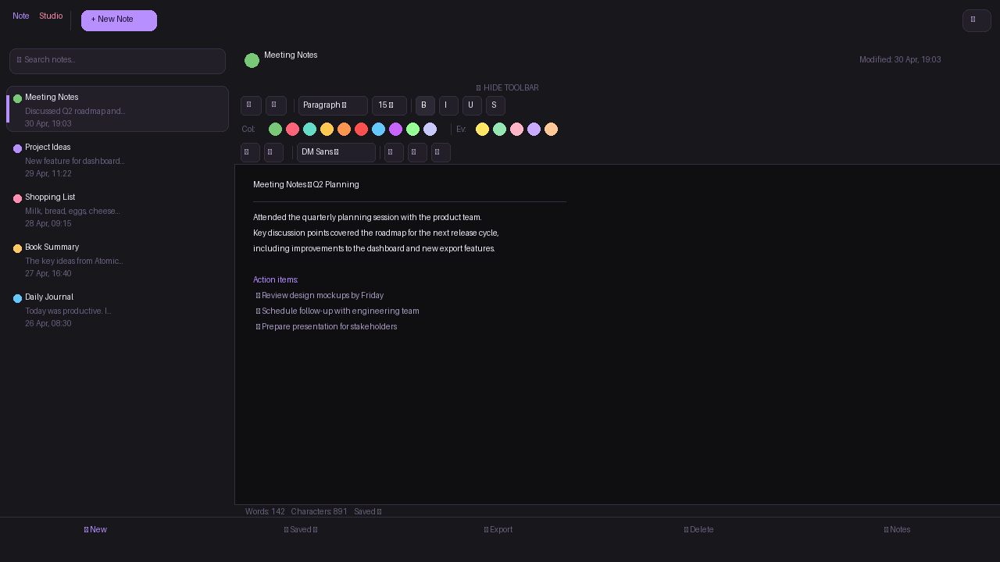
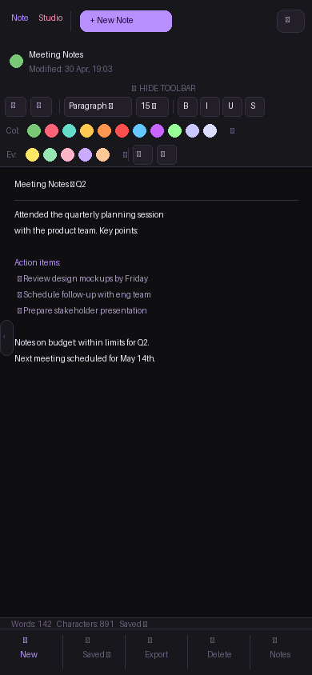

# ✦ NoteStudio

> A beautifully crafted, offline-first notes app — built as a single HTML file.

[](LICENSE)
[](https://gabrielbogdan5.github.io/NoteStudio/)
[]()
[]()
[]()

🔗 **Live app:** [gabrielbogdan5.github.io/NoteStudio](https://gabrielbogdan5.github.io/NoteStudio/)
📱 **Google Play:** Closed Testing
🌐 **Web page:** [gabrielbogdan5.github.io/NoteStudio-web](https://gabrielbogdan5.github.io/NoteStudio-web/)

*Dark · Light · Sepia — your notes, your way.*

---

## ✦ What's New — v1.3.0

| | Feature | Details |
|-|---------|---------|
| 📁 | Folder Tree | Create folders & subfolders, move notes between them |
| 🌍 | 4 Languages | Romanian, English, Polish, Russian |
| 📑 | PDF Export | jsPDF-based, downloads directly — no popups |
| 📋 | Copy All | Copy full note as plain text |
| 🎬 | Splash Screen | Branded cinematic intro with HGB signature |
| ✨ | Spring Animations | Emil Kowalski motion system + cinematic easing |
| 🎨 | New Color System | Scientific 9-stop perceptual scale, glass morphism |
| 📅 | Fixed Date Format | DD/MM/YYYY HH:MM — locale independent |
| 🗑 | Quick Delete | Trash button in editor meta row |
| 🔧 | Bug Fixes | Folder migration, duplicate IDs, UI overflow |

---

## ✦ Screenshots

| Desktop | Mobile |
|:-------:|:------:|
|  |  |

---

## ✦ Full Feature List

| | Feature | Description |
|--|---------|-------------|
| ✏️ | Rich Text Editor | Bold, italic, underline, strikethrough, colors, headings, lists, alignment |
| 🎨 | 3 Themes | Dark, Light, Sepia — persisted across sessions |
| 📁 | Folder Tree | Subfolders, drag-and-drop, move modal |
| 🏷 | Tags | Quick categorization |
| 📌 | Pin Notes | Pinned notes float to top |
| 🗑 | Trash | Soft delete with restore |
| 🔍 | Full-text Search | Instant search across titles and content |
| 💾 | Auto-Save | Debounced auto-save as you type |
| 📑 | Export PDF | Styled PDF download via jsPDF |
| 📋 | Copy All | Plain text clipboard copy |
| 🌍 | 4 Languages | EN · RO · PL · RU |
| 📴 | Offline | Full PWA with Service Worker v8 |
| 🎬 | Splash Screen | Cinematic HGB branded intro |

---

## ✦ Tech Stack

- **Zero runtime dependencies** — pure HTML/CSS/JS
- **jsPDF 2.5.1** — PDF generation (CDN, on demand)
- **Google Fonts** — Playfair Display + DM Sans
- **LocalStorage** — all data on device, never sent anywhere
- **Service Worker v8** — offline-first, cache notestudio-v8
- **AdMob** — banner ads via TWA

---

## ✦ File Structure

```
NoteStudio/
├── index.html            ← Entire app (single file)
├── sw.js                 ← Service Worker (cache notestudio-v8)
├── manifest.json         ← PWA manifest
├── offline.html          ← Offline fallback
├── icon-192x192.png      ← App icon
├── icon-512x512.png      ← App icon large
├── screenshot-mobile.png
└── screenshot-wide.png
```

---

## ✦ License

MIT — see [LICENSE](LICENSE)

---

<div align="center">

**HGB** · [notestudiocontact@gmail.com](mailto:notestudiocontact@gmail.com)

*NoteStudio v1.3.0 · © 2026 HGB · All rights reserved*

</div>
