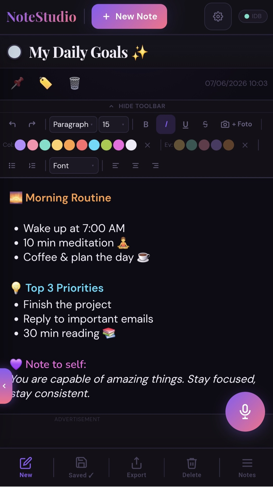
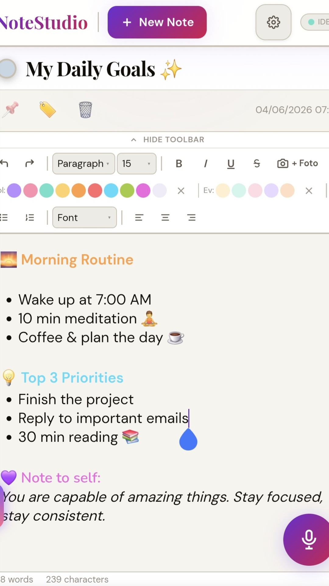
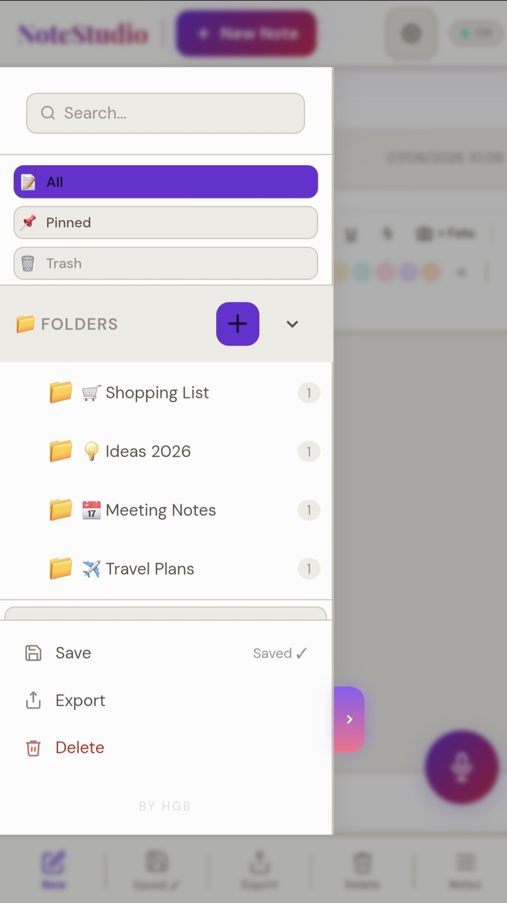
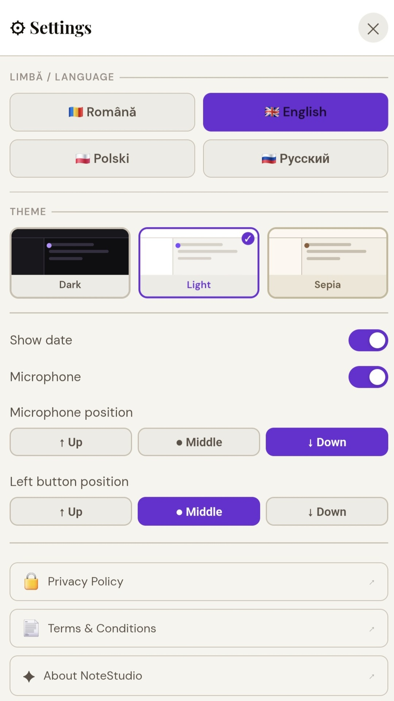

# ✦ NoteStudio

**A beautifully crafted, offline-first notes app — built as a single HTML file.**

🚀 **Live app:** [gabrielbogdan5.github.io/NoteStudio](https://gabrielbogdan5.github.io/NoteStudio/)&nbsp;&nbsp;📱 **Google Play:** Closed Testing 🌐  
**Web page:** [gabrielbogdan5.github.io/NoteStudio-web](https://gabrielbogdan5.github.io/NoteStudio-web)

*Dark · Light · Sepia — your notes, your way.*

---

## 📸 Screenshots

| Dark Editor | Light Editor | Sidebar | Settings |
|:-----------:|:------------:|:-------:|:--------:|
|  |  |  |  |

---

## ✦ What's New — v1.3.2

| | Feature | Details |
|--|---------|---------|
| 🔒 | Security Headers | CSP, X-Frame-Options and Referrer-Policy on all pages |
| 🌍 | Full i18n Fix | All UI strings translate correctly in all 4 languages |
| 🎤 | Mic & Button Position | Positions correctly saved and restored on startup |
| 📄 | New Pages | About, Help, Contact, What's New, Offline, 404 |
| 📱 | Improved Icons | Maskable icons for better Android home screen display |
| 🐛 | Bug Fixes | Settings sync on open, mic position default to Down |

▸ What's New — v1.3.1

| | Feature | Details |
|--|---------|---------|
| 🖼️ | Image Support | Insert photos from gallery or camera directly into notes |
| 🤏 | Pinch to Resize | Two-finger pinch gesture to resize images in editor |
| 🗑️ | Image Delete | Tap image to open options — delete or resize (S/M/L) |
| ✏️ | Image Caption | Add optional caption text below any image |
| 💾 | Undo Stack | Custom undo history covers image insertions and deletions |
| 🗄️ | IndexedDB Storage | Upgraded from localStorage — unlimited storage capacity |
| 📄 | PDF Preview | Preview note before saving as PDF via Android print dialog |
| 🎨 | Color in PDF | Text colors now render correctly in exported PDF |
| 🟢 | Storage Indicator | Live IDB/LS status pill visible in topbar |

▸ What's New — v1.3.0

| | Feature | Details |
|--|---------|---------|
| 📁 | Hierarchical Folders | Organize notes with nested folder system and colour tags |
| 🌍 | 4-Language Support | Romanian, English, Polish, Russian |
| 📄 | PDF Export | Export any note as a styled PDF document |
| 🌊 | Spring Animations | Smooth, natural motion throughout the UI |
| 🎨 | Color System | Glass morphism design with dark, light and sepia themes |

---

## ✦ Features

| Feature | Description |
|---------|-------------|
| ✍️ Rich Text Editor | Colors, fonts, headings, lists, bold/italic/underline |
| 📁 Folder System | Hierarchical folders with emoji & color coding |
| 🌍 4 Languages | English, Romanian, Polish, Russian |
| 🎨 3 Themes | Dark, Light and Sepia |
| 📄 PDF Export | Export notes as styled, branded PDFs |
| 🎤 Voice Input | Dictate notes hands-free with real-time transcription |
| 🖼️ Image Support | Insert photos from gallery or camera |
| ⚡ Fully Offline | Works without internet — all data stays on device |
| 🔒 Secure | Content Security Policy, no external data collection |
| 📱 PWA + TWA | Installable on Android via Play Store or browser |

---

## ✦ Links

| | Link |
|--|------|
| 🚀 App | [gabrielbogdan5.github.io/NoteStudio](https://gabrielbogdan5.github.io/NoteStudio/) |
| 🌐 Web | [gabrielbogdan5.github.io/NoteStudio-web](https://gabrielbogdan5.github.io/NoteStudio-web) |
| 🔒 Privacy | [Privacy Policy](https://gabrielbogdan5.github.io/NoteStudio/privacy-policy.html) |
| 📋 Terms | [Terms & Conditions](https://gabrielbogdan5.github.io/NoteStudio/terms-and-conditions.html) |
| 📖 Help | [Help Guide](https://gabrielbogdan5.github.io/NoteStudio/help.html) |
| 📧 Contact | [notestudiocontact@gmail.com](mailto:notestudiocontact@gmail.com) |

---

*BY HGB — gabrielbogdan5*

